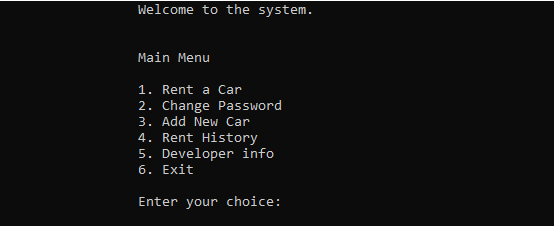
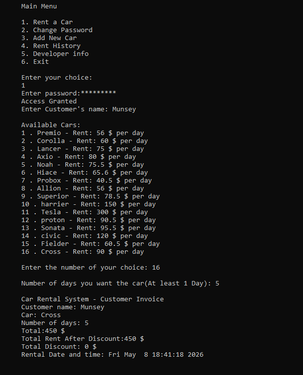
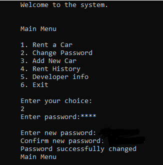
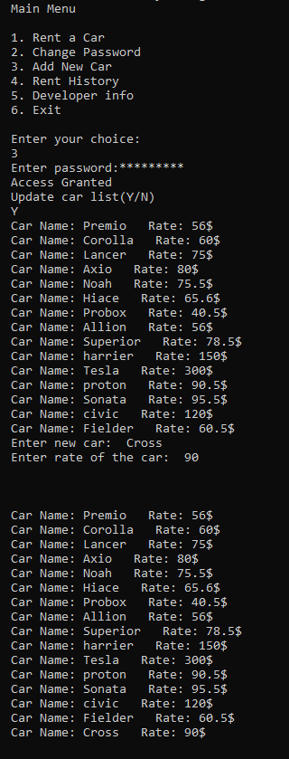
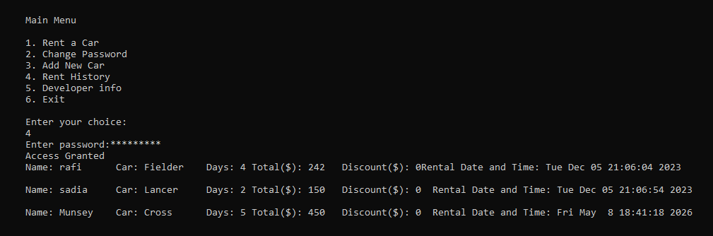
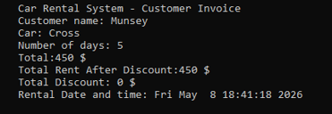

# 🚗 Car Rental System (Console-Based)
## Car_Rental_System is a basic entry level program that is used the Object Oriented Program by using the c++ language.
It is an entry level programming that can help people to understand how rental system works at basic level.


This is a terminal-based car rental management system written in C++. It allows users to rent cars, view available vehicles, generate invoices with discounts, maintain rental history, update car inventory, and secure the system with password protection.

## ✨ Features

- **User Authentication** – Password-protected access (with hidden input & asterisks)
- **Car Rental** – Choose from a list of available cars, specify rental days, and get a detailed invoice
- **Discount Logic** – Automatic 5% discount on total rentals of $1500 or more
- **Invoice Generation** – Displays rental details, total cost, discount, and timestamp; saves to `Invoice.txt`
- **Car Inventory Management** – Add new cars to the system (password required)
- **Rental History** – View all past invoices stored in `Invoice.txt`
- **Change Password** – Update the system password securely
- **Developer Info** – Display developer credits from a text file
- **Error Handling** – Uses exception handling for file and runtime errors

## 🛠️ Technologies Used

- C++ (Standard libraries: iostream, fstream, string, stdexcept, ctime, conio.h)
- File-based data storage (`.txt` files)

## 📁 File Structure
```
├── CarRentalSystem.cpp # Main source code
├── cars.txt # Car database (name dailyRate)
├── cars pass.txt # Stored password (plain text)
├── welcome_message.txt # Welcome screen text
├── developer_info.txt # Developer information
└── Invoice.txt # Rental history log (auto-generated)
```


## 🚀 Getting Started

### Prerequisites
- A C++ compiler (e.g., g++, MinGW, MSVC)
- Windows (due to `conio.h` for `_getch()`). For Linux/macOS, replace password input logic.

### Compilation & Execution

1. Clone or download the source code and all `.txt` files into the same directory.
2. Compile using a C++ compiler(Try to use codeblocks):
   ```
   g++ CarRentalSystem.cpp -o car_rental.exe
   ```
3. Run the executable
  ```
    ./car_rental.exe
```
## 1. Main Menu Options
1. Rent a Car
2. Change Password
3. Add New Car
4. Rent History
5. Developer info
6. Exit
<br>


## 2. Rent a car
- Enter system password (masked input)
- Provide customer name
- Choose a car from the numbered list
- Enter rental days (positive integer)
- Invoice is displayed and saved to `Invoice.txt`
<br>


## 3. Change Password
- Enter current password
- Set and confirm new password
- Updated password written to `cars pass.txt`
<br>


## 4. Add New Car
- Password required
- Displays current car list
- Prompts for new car name and daily rate
- Appends to `cars.txt`
<br>


## 5. Rent History
- Password required
- Prints all past invoices from `Invoice.txt`
<br>


## 6. Exit
- Terminates the program
<br>

## Sample Invoice 

<br>
# Important Notes
- The password is stored in plain text (`cars pass.txt`). For production, implement proper hashing.
- conio.h is Windows-specific. For cross‑platform use, replace `_getch()` with standard terminal handling (e.g., termios on Linux).
- File paths are hardcoded – keep all .txt files in the same directory as the executable.

## Contributing
**This is a first project – feel free to fork, improve, and submit pull requests. Suggested improvements:**

- Hash passwords
- Support cross-platform input masking
- Use a database instead of text files
- Add car availability tracking
- Improve input validation

## 📄 License
*This project is open source and available under the MIT License.*

## 👨‍💻 *Author*
Developed as a student project.
**See `developer_info.txt` for details.**
